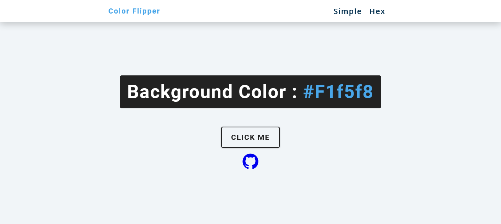
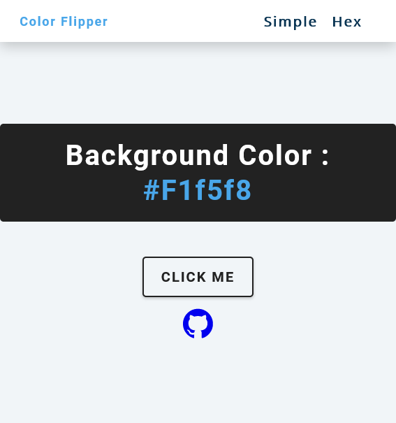

# Side-hustle Internship Task 4 - Color flipper
This is a program that generates different colors as either color name, rgb or hex value as you click on the button.

## Screenshot

### Desktop 

### Mobile

## Live preview
Click [here](https://oluwayemivictor-color-flipper.netlify.app/) to view the live site.